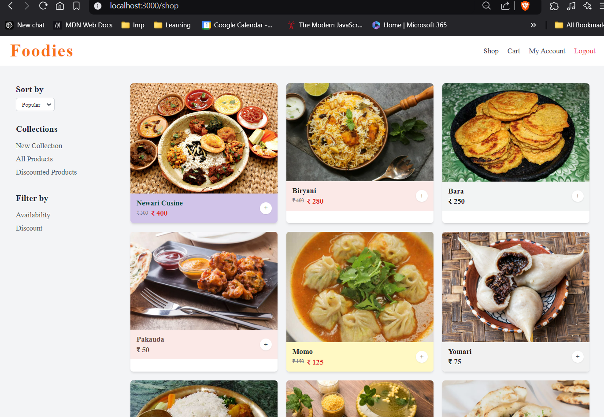
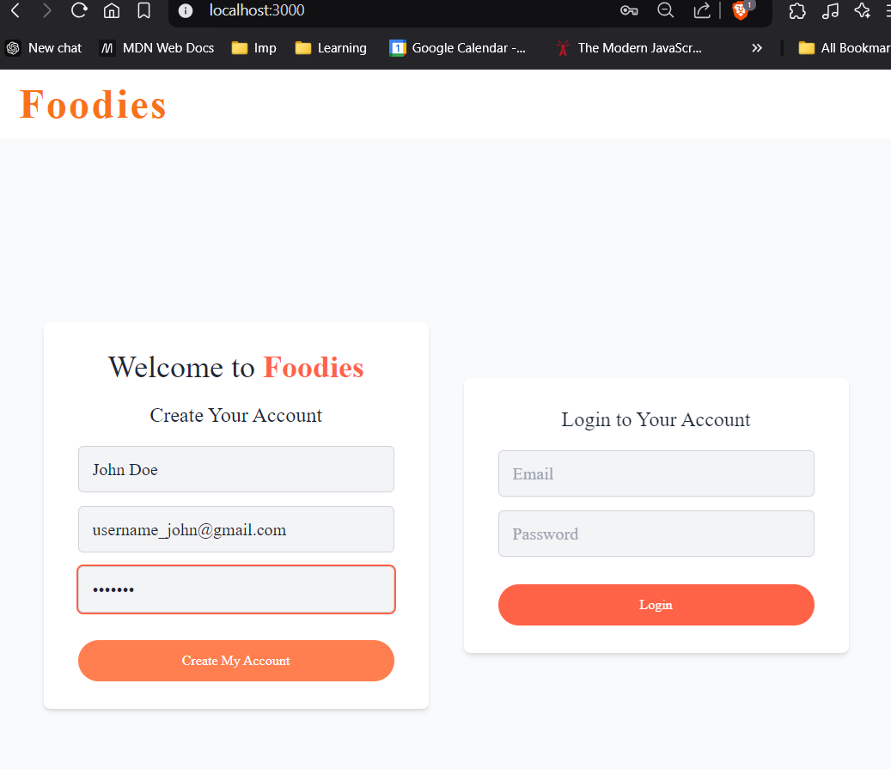
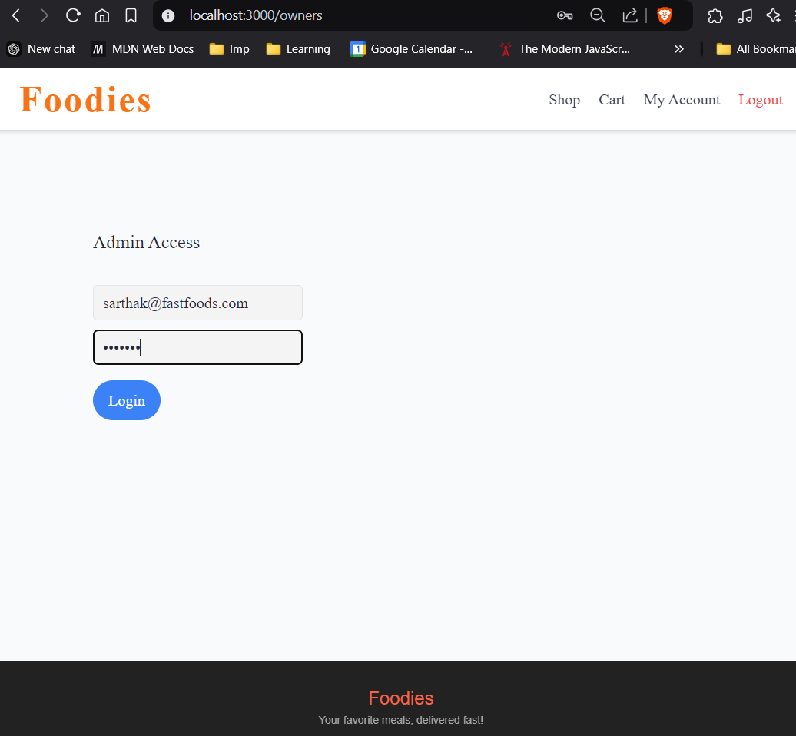
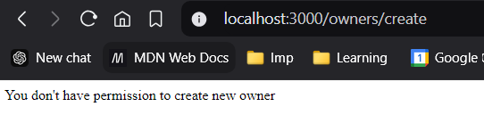
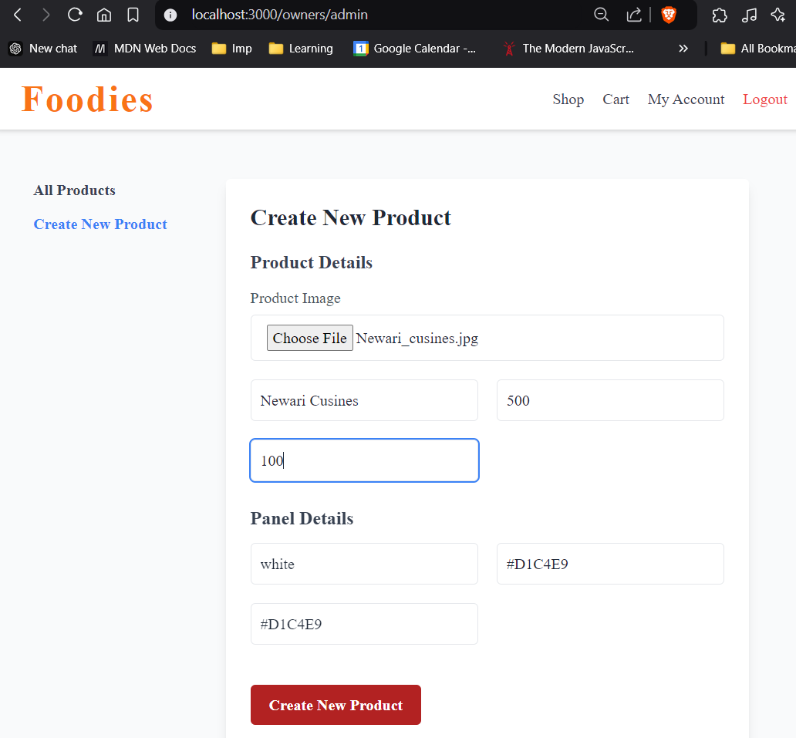
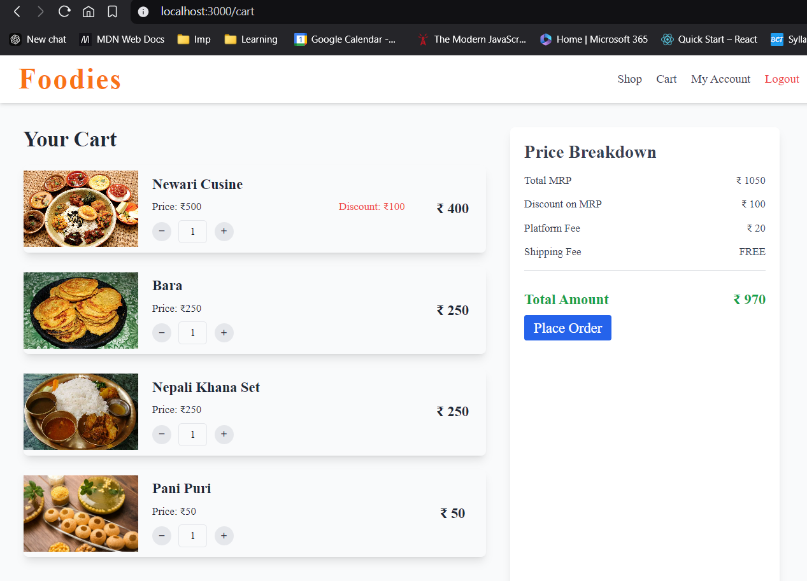
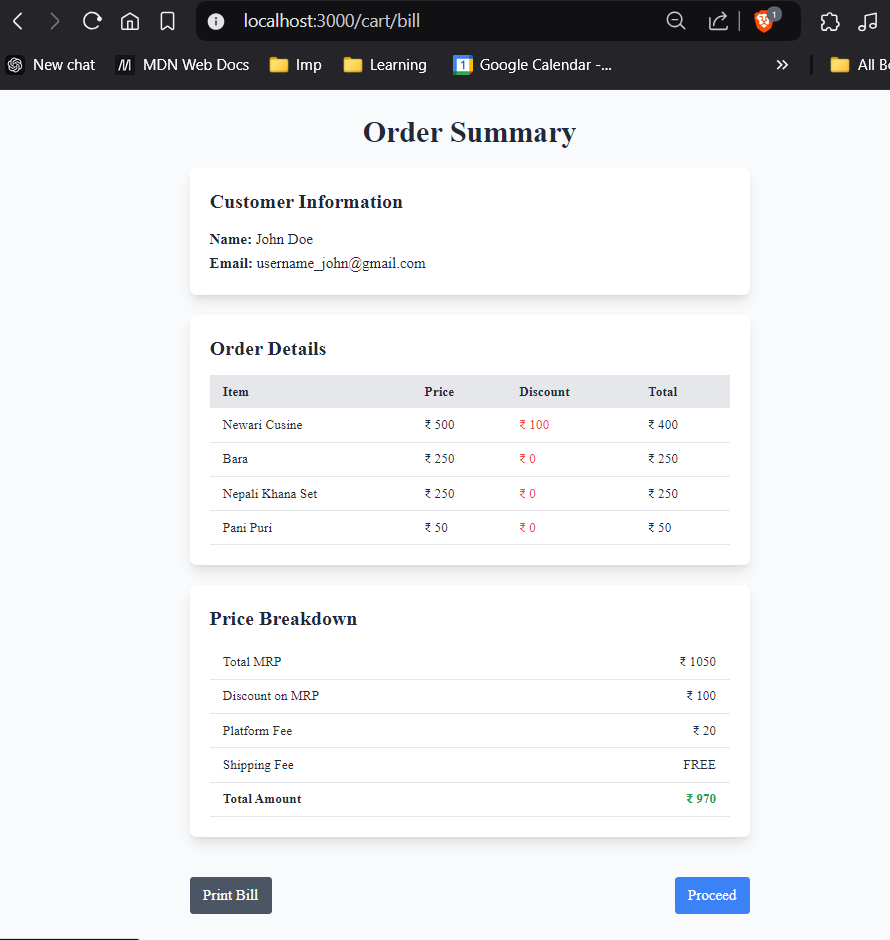

# Food_Delivery_App-BE

This is the backend of a food delivery application built using Node.js, Express, and MongoDB. It provides features like user authentication, cart management, order processing, and an admin panel for shop owners to manage products.



## Installation 

To set up the backend for this food delivery app, follow these steps:

1. Clone the repository:
```bash
git clone https://github.com/imSarthakGautam/Food_Delivery_App-BE.git
cd food-delivery-app-backend
```

2. Install the dependencies.

``` npm install 
express
mongoose
jsonwebtoken
cookie-parser
bcrypt
multer
debug (debugger)
config
dotenv
express-session
connect-flash
```

3. Create a .env file to store environment variables.
The `.env` file is used to store environment-specific variables that your application can access. Here are the key variables typically used in a Node.js app:

- **MONGO_URI**: MongoDB connection URI.
- **JWT_SECRET**: Secret key used for generating JWT tokens.
- **NODE_ENV**: Defines the environment (e.g., `development`, `production`).
- **PORT**: The port number the app will listen on (default is `3000`).

You can access these variables using the `dotenv` package and `process.env`.

**Example `.env` file:**
```bash
MONGO_URI=mongodb://127.0.0.1:27017/mydb
JWT_SECRET=mySecretKey123
NODE_ENV=development
PORT=3000
```
To load environment variables from the .env file, use the following code at the start of your application:
```js
require('dotenv').config();
```
then access variables like process.env.JWT_SECRET


4. Create a `development.json` 'for MONGODB_URI and setup a mongodb connection.

You can store additional configuration settings in a JSON file, like `development.json`, and access them programmatically. This is useful for storing MongoDB connection URIs or other environment-specific settings.

```js
{
  "MONGODB_URI": "mongodb://127.0.0.1:27017/mydb"
}
```
To access these settings in your application, you can use the config module, which allows for environment-specific configurations.
```bash
npm install config
```
To access it we can use `config` and `$config.get()`
```js
const config = require('config');
const mongoURI = config.get('MONGODB_URI');
```

5. Setting Environment Variables via CMD/POWERSHELL

- Set the environment variable DEBUG to the value 'development:*' for the current session.
```CMD
set DEBUG=development:*
set DEBUG= 
```
It configures the DEBUG environment variable to output logs for the development environment in a specific format. 

Similarly, to Setup development environment in Powershell

```powershell
$env:DEBUG='development:*'
Remove-Item Env:DEBUG
```
6. Install the ejs file after setting up view engine as ejs.


## Usages


### Login/Logout:
Users can login or register via `/users/login` and `/users/register`. To logout, users can go to `/users/logout`.



### Admin Actions:
Shop owners can manage their products, view orders, and create new products via the `/owner/products` and `/owner/admin` routes.



Admin can be selected only in dev environment.


### Creating a Product:
You can create a new product by logging into the admin panel at `/owner/admin` and submitting the product details (name, price, discount, image, etc.).


### Adding Products to Cart:
Users can browse products on the `/shop` page and add items to their cart by clicking "Add to Cart".


### Placing an Order:
Once the user is satisfied with their cart, they can proceed to checkout, where they can see the bill,print it if they like and place the order.
Once the order is placed, cart will be empty



## Tech-Stack and Packages

- **Node.js**: JavaScript runtime environment.
- **Express**: Web framework for Node.js.
- **MongoDB**: NoSQL database used to store data.
- **Mongoose**: MongoDB ODM for interacting with the database.
- **jsonwebtoken**: For generating JWT tokens for user authentication.
- **bcrypt**: For hashing user passwords.
- **cookie-parser**: To parse cookies.
- **multer**: For handling file uploads (e.g., product images).
- **dotenv**: To load environment variables.
- **express-session**: To handle session management.
- **connect-flash**: To display flash messages (e.g., success/error).

## Routes

### User Routes:
- **POST** `/users/register`: Register a new user.
- **POST** `/users/login`: Login a user and generate a JWT token.
- **GET** `/users/logout`: Logout the user by destroying the session.

### Product Routes (Owner/Admin):
- **GET** `/owner/products`: Show all products.
- **POST** `/owner/products/create`: Create a new product (only accessible by admin).
- **GET** `/owner/admin`: Show the admin panel to manage products.

### Cart Routes:
- **GET** `/cart`: Show the user's cart.
- **POST** `/addtocart/:id`: Add a product to the cart.
- **GET** `/cart/bill`: Get the cart bill (total price, taxes, etc.).

### Shop Routes:
- **GET** `/shop`: Show all products in the shop.
- **POST** `/order`: Place an order based on cart items.

### Development Only Route:
- **POST** `/owners/create`: Create a new shop owner (only in development).

### Admin Panel:
- **GET** `/owner/admin`: Display the admin panel for managing products.

